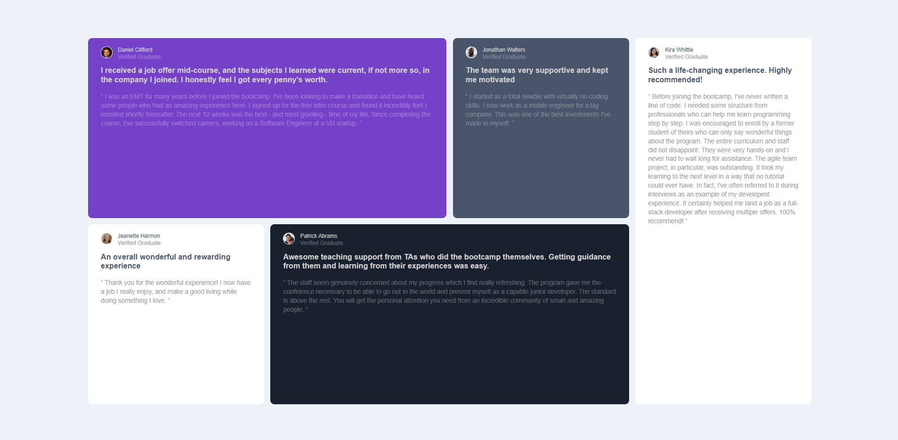
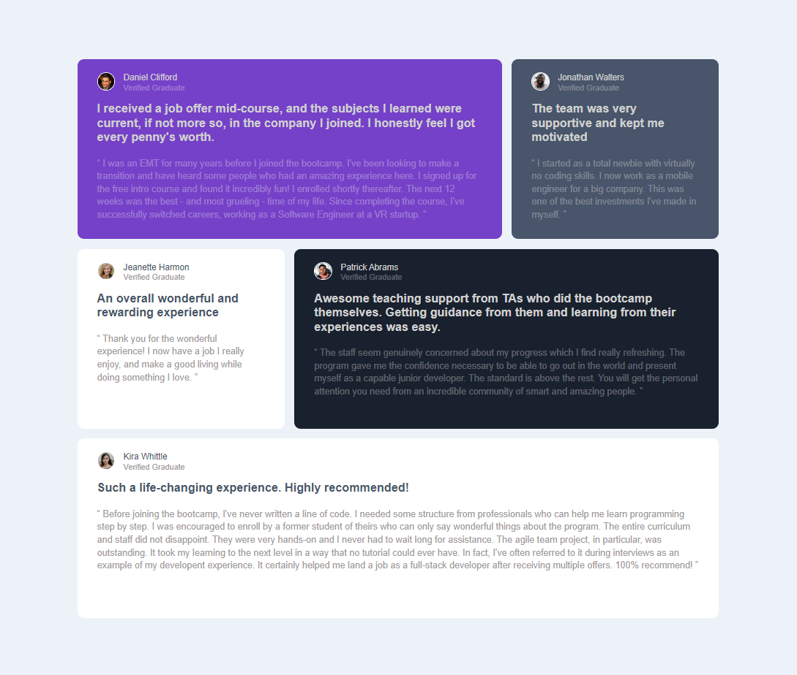
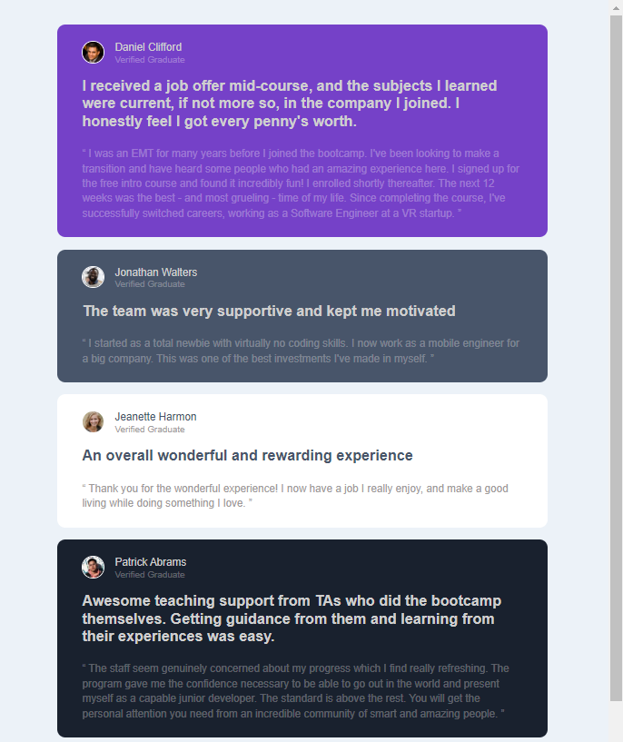

# Frontend Mentor - Testimonials grid section solution

This is a solution to the [Testimonials grid section challenge on Frontend Mentor](https://www.frontendmentor.io/challenges/testimonials-grid-section-Nnw6J7Un7). Frontend Mentor challenges help you improve your coding skills by building realistic projects.

## Table of contents

- [Overview](#overview)
  - To create multiple cards that cover user's review onto a company
    - showed up the profile pic with user name and title
    - Showed the summary of the review
    - Showed the details of the review
- [My process](#my-process)
  - [Built with](#built-with)

## Screenshot

## My process

1. Prepare the grid layer for the cards based on a browsesr width first
2. Based on the intended layout to assign cards to occupy which of the grid area
3. Set-up basic CSS styles (i.e: background-color, border) for each card
4. Turn the Profile Div into a sub-grid, so as to place the Profile pic on the Left and the User Name + Title on the Right
5. Moving on to lower down the width size and see any re-position of the cards to make a decent look and feel for user at a Tablet Browser width
6. Adjust and re-position of the layout to support Mobile Phone Browser Width
7. Fine tune to adjust the Text Color

## Built with

- Semantic HTML5 markup
- CSS custom properties
- Flexbox
- CSS Grid

## Author

- Created by user - [Nobodyyyy2468]

## Acknowledgments

This is where you can give a hat tip to anyone who helped you out on this project.
